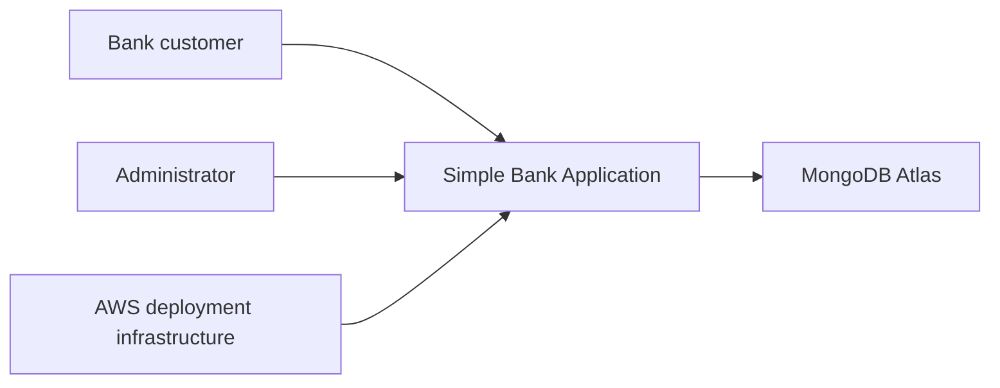
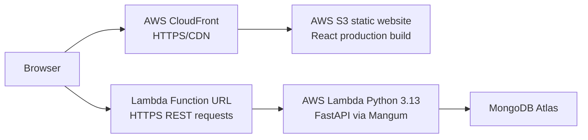
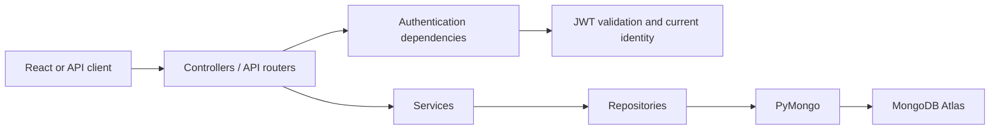
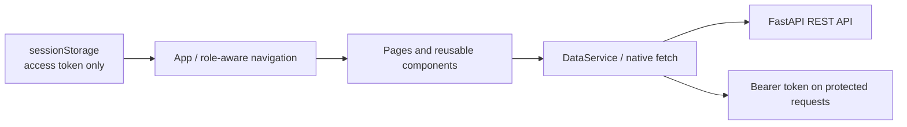
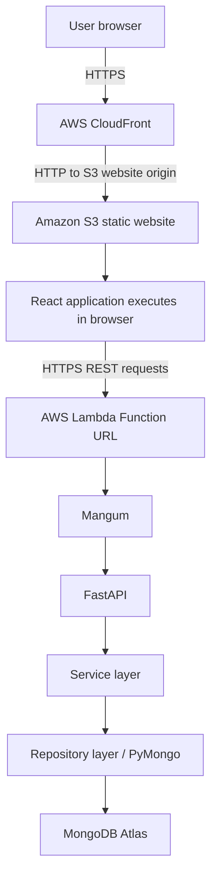

# Architecture

This document is a lightweight C4-style view of the deployed Simple Bank Application.

## System Context

The Bank Application is a full-stack web application for customer self-service banking and administrator-managed customer, account, and transaction operations.

- **Bank customer** registers, signs in, views only owned accounts and transactions, and performs owned-account money operations.
- **Administrator** signs in and uses the protected management UI for customers, accounts, and audit history.
- **MongoDB Atlas** is the current cloud document database.
- **AWS deployment infrastructure** delivers the React frontend through CloudFront and S3, and runs the FastAPI API in Lambda. It does not replace MongoDB Atlas.

## Container View

The application containers are:

| Container | Technology | Responsibility |
| --- | --- | --- |
| Frontend | React + Vite | Pages, role-aware UI, forms, session behavior, and REST calls. |
| REST API | FastAPI + Mangum | HTTP routes, JWT validation, authorization, business rules, and API responses. Uvicorn remains the local development server. |
| Database | MongoDB Atlas + PyMongo | Persistent customer, account, and transaction documents. |

The React production build is deployed with **S3 static website hosting** and delivered over HTTPS through **CloudFront**. The API is deployed to **AWS Lambda Python 3.13**, exposed through a **Lambda Function URL**, with FastAPI adapted by Mangum. MongoDB Atlas remains the cloud database. The production frontend uses `VITE_API_BASE_URL` for the Function URL; local development retains its localhost fallback.

CloudFront uses the S3 static website endpoint as its HTTP origin while providing HTTPS to browser users. The Lambda Function URL provides HTTPS API access. FastAPI CORS permits the deployed CloudFront origin through environment configuration. Lambda runtime configuration, including database/JWT settings and the deployed frontend origin, is supplied as environment variables rather than source code. The Lambda timeout is configured to 30 seconds to allow MongoDB-backed requests such as login to complete. The local React/Vite and FastAPI/Uvicorn setup remains supported for development.

## Backend Component View

FastAPI preserves a Controller → Service → Repository separation. Controllers own HTTP concerns, services own banking and ownership rules, and repositories own PyMongo/BSON access.

`dependencies.py` is the composition point for shared repositories, services, and security dependencies. Public registration/login routes create or validate customer identities. Protected requests carry a Bearer JWT; the authentication dependency validates the token and loads the stored identity. `require_admin` protects administrative routes, while customer self-service routes derive the current customer identity and enforce account ownership in the service layer.

## Frontend Component View

`App.jsx` owns session restoration, current-user state, role-aware navigation, and centralized `401` handling. Pages such as Customers, Accounts, Transactions, My Accounts, and My Transactions own page-level request state. Reusable forms and list components receive data and callback props from those pages.

`DataService.js` centralizes HTTP requests and adds the Bearer token for protected calls. React stores only the access token in `sessionStorage`, validates it through `/api/auth/me` on restoration, and obtains username/role from the backend response. Frontend role-aware navigation improves usability, while FastAPI remains the authorization boundary.

## Deployment View

The deployed request path is:

`Browser → CloudFront → S3-hosted React frontend → Lambda Function URL → Lambda-hosted FastAPI via Mangum → MongoDB Atlas`

The deployed frontend uses `VITE_API_BASE_URL` for the Function URL, while local development retains its localhost fallback. Deployment configuration keeps MongoDB settings, JWT signing configuration, the CloudFront CORS origin, and AWS credentials outside source control.
